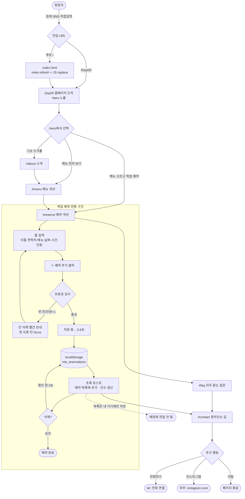

# Day07 · 모닝브루 사용자 흐름(User Flow) 분석

> 대상: `Day05/index.html` (루트 `/` 는 이 페이지로 자동 리다이렉트)
> 목적: 방문자가 홈페이지에서 거치는 경로를 추적하고, 이탈/마찰 지점을 찾아 개선안 도출
> 작성일: 2026-06-20

---

## 1. 페이지 구조 한눈에 보기

`Day05/index.html` 은 앵커(`#`)로 연결된 **단일 페이지(one-pager)** 입니다.

| 순서 | 섹션 | id | 역할 | 행동 유도(CTA) |
|---|---|---|---|---|
| 1 | Hero | — | 첫인상·핵심 메시지 | `메뉴 고르고 픽업 예약`(→#reserve), `메뉴 먼저 보기`(→#menu) |
| 2 | 소개 | `#about` | 카페 정체성(엔티티) 설명 | 없음 |
| 3 | 대표 메뉴 | `#menu` | 메뉴 4종 + 영업/픽업 시간 | 없음(읽기 전용 카드) |
| 4 | 픽업 예약 | `#reserve` | 폼 입력 → 목록 등록 (localStorage) | `＋ 예약 추가`, `삭제` |
| 5 | FAQ | `#faq` | 자주 묻는 질문 아코디언 | 없음 |
| 6 | 찾아오는 길 | `#contact` | 위치·연락처 | `전화하기`(tel:), `인스타그램`(외부) |

---

## 2. 사용자 흐름도 (Mermaid)

---

## 3. 흐름에서 드러난 마찰·이탈 지점

### 🔴 치명적 — 예약이 매장에 전달되지 않음
- 예약 데이터는 **`localStorage`(방문자 본인 기기)에만** 저장됩니다. 매장 주인은 예약을 볼 수 없고, 사용자도 다른 기기에서 확인 불가.
- 사용자는 "예약이 추가되었습니다!" 토스트를 보고 **예약이 접수됐다고 오해**할 위험이 큼. → 노쇼 아닌 "유령 예약" 발생.
- **개선:** 폼 submit 시 실제 채널 연결 — (a) `mailto:`/폼 전송 서비스(Formspree·Google Form), (b) 카카오톡 채널/네이버 예약 링크, (c) 백엔드 API. 최소한 "이 예약은 이 기기에만 저장됩니다" 안내 문구 추가.

### 🟠 높음 — 메뉴 → 예약 연결이 끊김
- Hero의 "메뉴 고르고" CTA로 와도, 메뉴 카드(`#menu`)는 **클릭 불가한 읽기 전용**. 사용자가 메뉴를 보고 마음에 들어도 예약 폼의 드롭다운에서 **다시 선택**해야 함(중복 작업).
- **개선:** 각 메뉴 카드에 `이 메뉴로 예약` 버튼 → 클릭 시 `#reserve`로 스크롤 + `select#menu` 자동 선택(pre-fill).

### 🟠 높음 — 긴 페이지인데 내비게이션이 없음
- 6개 섹션이 세로로 길게 이어지는데 상단 고정 내비/목차가 없음. Hero를 지나치면 예약·연락처로 되돌아가기 어려움.
- **개선:** 상단 sticky 헤더(메뉴·예약·위치 앵커) 또는 모바일용 하단 고정 `예약하기` 버튼(sticky CTA).

### 🟡 중간 — 예약 폼 유효성의 빈틈
- `날짜`는 오늘 이후만 막아두었으나, **월요일(휴무) 차단·영업시간(08:00~19:30) 밖 픽업 시간 차단**은 없음. 휴무일/마감 후 시간도 예약 가능.
- `연락처`는 빈 칸만 검사하고 **형식 검증 없음**(`abc`도 통과).
- **개선:** 월요일 선택 차단, `pickup` time `min/max` 지정, 전화번호 정규식 안내.

### 🟡 중간 — 위치 정보가 텍스트뿐
- `#contact`에 주소 텍스트만 있고 **지도 임베드/길찾기 링크 없음**. "도보 8분"을 직접 확인할 방법이 없음.
- **개선:** 네이버/카카오 지도 임베드 또는 길찾기 딥링크 버튼.

### ⚪ 낮음 — 신뢰 요소가 모두 "실습용 예시"
- 전화·주소·인스타가 전부 가짜값. 실제 운영 전 교체 필요(현재는 실습 단계이므로 정상).

---

## 4. 우선순위 개선 로드맵

| 우선순위 | 개선 항목 | 기대 효과 | 난이도 |
|---|---|---|---|
| 1 | 예약 실제 전송(폼 서비스/메시지 채널) + 안내 문구 | 유령 예약 제거, 실제 전환 | 중 |
| 2 | 메뉴 카드 → 예약 폼 pre-fill 연결 | 입력 마찰 감소 | 하 |
| 3 | sticky 예약 CTA / 상단 내비 | 재진입·전환율↑ | 하 |
| 4 | 휴무일·영업시간·연락처 형식 검증 | 잘못된 예약 차단 | 하 |
| 5 | 지도 임베드/길찾기 | 방문 전환↑ | 하 |

---

## 5. 한 줄 결론

흐름 자체(도착 → 메뉴 인지 → 예약 → 연락)는 자연스럽지만, **"예약 → 매장 전달"이 끊겨 있는 것이 가장 큰 구멍**이다. 그다음으로 **메뉴-예약 연결**과 **긴 페이지의 재진입 동선(sticky CTA)**을 보완하면 전환 흐름이 완성된다.
